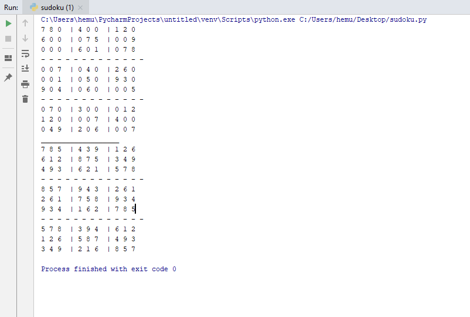

# SUDOKU GAME 

In This Code You have to Consider:
  
.The #BOARD is represented as LIST OF LISTS using #numpy 
.where 0 INDICATE cell not allocated 
.Other cells are filled with numbers 1 to 9
  

